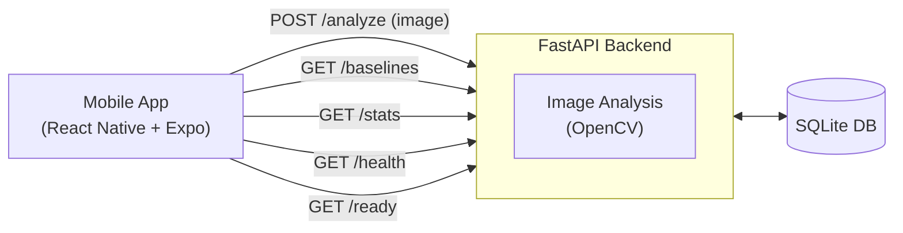

This is a mobile app 

Tech stack:
- React Native
- Expo
- FastAPI
- OpenCV
- SQLite
- Docker

Demo: 

System diagram:

```mermaid
flowchart LR
  A["Mobile App<br/>(React Native + Expo)"]
  C[("SQLite DB")]

  subgraph B["FastAPI Backend"]
    D["Image Analysis<br/>(OpenCV)"]
  end

  A -- "POST /analyze (image)" --> B
  A -- "GET /baselines" --> B
  A -- "GET /stats" --> B
  A -- "GET /health" --> B
  A -- "GET /ready" --> B

  B <--> C
```
