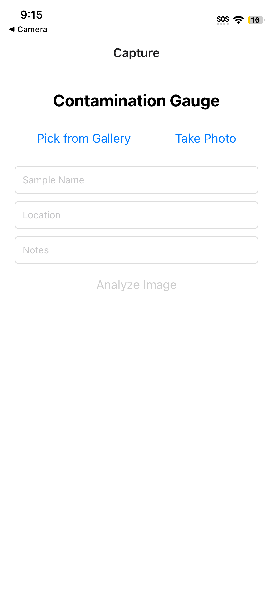
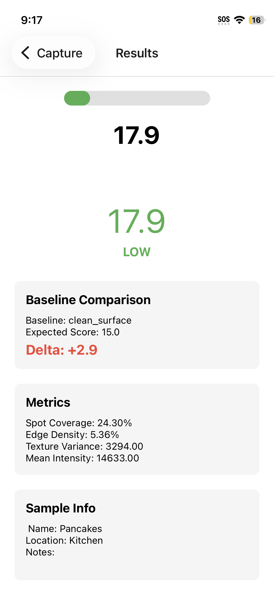
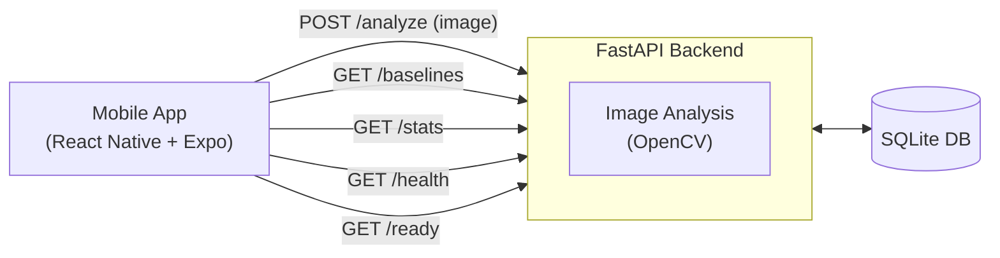

I built a mobile application with a backend pipeline that processes user-provided inputs to detect contamination for a job application. But they found the developer before I could turn my resume in lol. This project focused on designing the system to handle untrusted input and explored how it behaves under malformed and adversarial input. 

Tech stack:
- React Native
- Expo
- FastAPI
- OpenCV
- SQLite
- Docker

Testing method:
- send correupted data & unexpected payloads

Demo: 

<!--  -->

System diagram:

